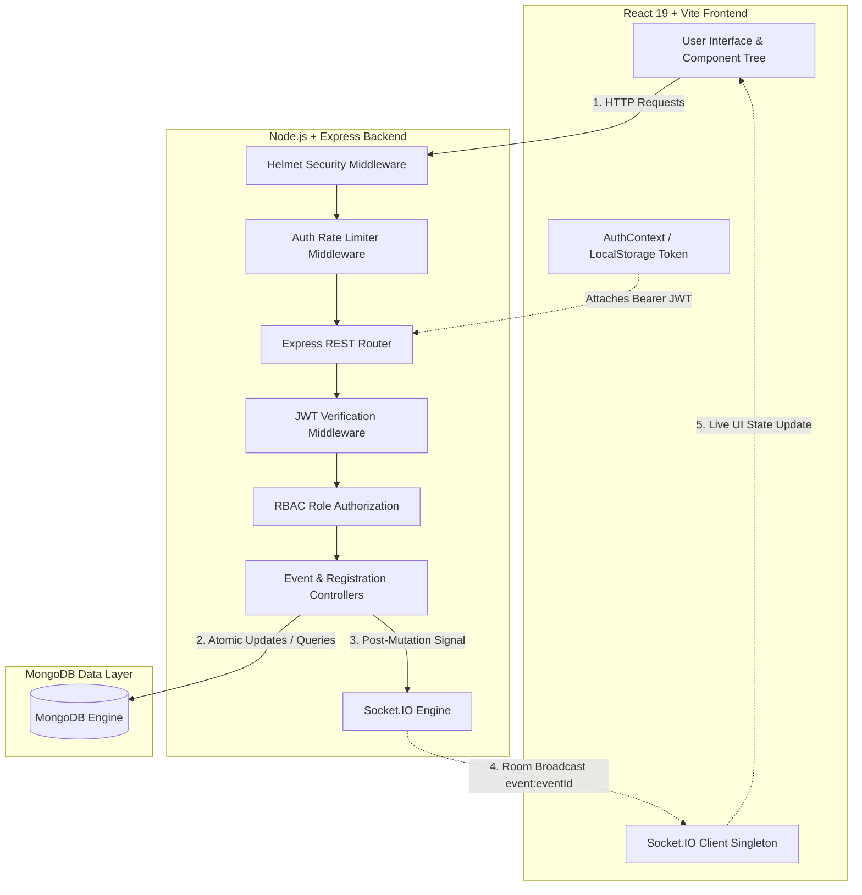

# CampusPulse
### Real-Time Campus Event Discovery & Registration Platform

[](https://nodejs.org/)
[](https://react.dev/)
[](https://expressjs.com/)
[](https://www.mongodb.com/)
[](https://socket.io/)
[](https://tailwindcss.com/)
[](https://helmetjs.github.io/)

**CampusPulse** is a production-configurable, security-hardened, real-time campus event discovery and registration platform. Built for university campuses, it allows students to explore events, manage registrations with atomic capacity enforcement, and observe **real-time participant updates** via Socket.IO. For event organizers and campus administrators, CampusPulse provides an intuitive dashboard for event creation, editing, soft-cancellation, and participant roster tracking.

---

## 📌 Key Features

- 🎓 **Student Event Discovery**: Live search by title/description, category pills (`Hackathons`, `Workshops`, `Sports`, `Cultural`, etc.), and status filtering (`OPEN`, `CLOSED`, `CANCELLED`, `COMPLETED`).
- 🎟️ **Event Pass Management**: Students can register for events with atomic capacity validation, view active passes under **My Events**, and release capacity instantly via registration cancellation.
- ⚡ **Real-Time Synchronization**: Socket.IO event room isolation (`event:<eventId>`) broadcasts live participant counts, event status updates, and cancellation notices across all active client browsers without page refreshes.
- 👑 **Admin Management Dashboard**: Comprehensive metrics overview (`Total Events`, `Open`, `Cancelled`, `Completed`), soft-cancellation workflow, and participant roster auditing modal.
- 🛡️ **Production-Grade Security**: Helmet HTTP header security, IP-based authentication rate limiting on `/api/auth/login` and `/api/auth/register`, stateless JWT authentication, `bcryptjs` password hashing, and strict Role-Based Access Control (RBAC).

---

## 🛠️ Technology Stack

### Frontend
- **Framework & Build:** React 19, Vite
- **Styling:** Vanilla CSS + Tailwind CSS v4
- **Routing:** React Router v7
- **Real-Time Client:** Socket.IO Client v4
- **Icons:** Lucide React

### Backend
- **Runtime & Server:** Node.js, Express.js
- **Real-Time Engine:** Socket.IO Server v4
- **Authentication & Security:** JSON Web Token (JWT), `bcryptjs`, `helmet`, `express-rate-limit`
- **Database ORM:** Mongoose v8

### Database
- **Database Engine:** MongoDB (Document-oriented store)

---

## 🏗️ System Architecture

CampusPulse uses a clean separation of concerns where **REST APIs serve as the authoritative layer for state persistence**, and **Socket.IO handles real-time event broadcasting** to room subscribers after successful MongoDB mutations.



---

## ⚡ Real-Time Registration Flow

```text
Student clicks "Register"
        ↓
POST /api/events/:id/register
        ↓
Express verifies JWT & student role
        ↓
Atomic MongoDB update ($inc & capacity query check)
        ↓
Participant count updated in database
        ↓
Socket.IO emits 'participant-count-updated' to room event:<eventId>
        ↓
Connected client browsers in event:<eventId> update UI automatically
```

---

## 🔑 Development Demo Credentials

Run `npm run seed` in the `server/` directory to populate MongoDB with initial demo accounts and sample campus events.

> [!NOTE]
> **LOCAL DEVELOPMENT ONLY**: The credentials below are provided strictly for local evaluation and testing. Do NOT use these passwords in production environments.

| Role | Email | Password | Scope & Permissions |
| :--- | :--- | :--- | :--- |
| **👑 Admin** | `admin@campuspulse.local` | `admin123` | Create, Edit, Soft-Cancel Events; View Participant Rosters |
| **🎓 Student** | `student@campuspulse.local` | `student123` | Register for Events, Cancel Registrations, View My Events |

---

## 📡 API Endpoint Reference Table

| Method | Endpoint | Access Level | Description |
| :--- | :--- | :--- | :--- |
| `GET` | `/api/health` | Public | System health check and API status |
| `POST` | `/api/auth/register` | Public (Rate Limited) | Register new student account (Forces `role = student`) |
| `POST` | `/api/auth/login` | Public (Rate Limited) | Authenticate credentials & receive signed JWT token |
| `GET` | `/api/auth/me` | 🔒 Authenticated | Retrieve authenticated user profile |
| `GET` | `/api/events` | Public | List events with search, category, and status filters |
| `GET` | `/api/events/:id` | Public | Get detailed event information by ID |
| `POST` | `/api/events` | 👑 Admin Only | Publish a new campus event |
| `PUT` | `/api/events/:id` | 👑 Admin Only | Update an existing event's details |
| `DELETE` | `/api/events/:id` | 👑 Admin Only | Permanently delete an event |
| `PATCH` | `/api/events/:id/cancel` | 👑 Admin Only | Soft-cancel an event and broadcast real-time status |
| `POST` | `/api/events/:id/register` | 🎓 Student Only | Register current student for an event (Atomic `$inc`) |
| `DELETE` | `/api/events/:id/register` | 🎓 Student Only | Cancel student registration and release event capacity |
| `GET` | `/api/events/:id/registrations` | 👑 Admin Only | Get full participant roster for an event |
| `GET` | `/api/users/me/events` | 🔒 Authenticated | Get current user's registered event passes |

---

## 📁 Project Structure

```text
CampusPulse/
├── client/                     # React + Vite Frontend App
│   ├── src/
│   │   ├── components/         # UI Components (Navbar, EventCard, ProtectedRoute, etc.)
│   │   ├── context/            # React AuthContext (user, token, auth operations)
│   │   ├── layouts/            # Layout wrappers (AppLayout)
│   │   ├── pages/              # Application Pages (Home, Events, EventDetails, MyEvents, Login, Register, AdminDashboard, etc.)
│   │   ├── services/           # API Services (api.js, authService.js, eventService.js, registrationService.js, socket.js)
│   │   ├── App.jsx             # React Router DOM v7 & AuthProvider setup
│   │   ├── main.jsx            # React root entrypoint
│   │   └── index.css           # Global Tailwind CSS styles
│   ├── .env.example            # Client environment template
│   ├── package.json
│   └── vite.config.js
│
├── server/                     # Node.js + Express + Socket.IO Backend
│   ├── config/                 # Database configuration (db.js)
│   ├── controllers/            # Route Controllers (authController, eventController, registrationController)
│   ├── middleware/             # Middleware (authMiddleware, roleMiddleware)
│   ├── models/                 # Mongoose Models (User, Event, Registration)
│   ├── routes/                 # Express Routers (authRoutes, eventRoutes, registrationRoutes)
│   ├── sockets/                # Socket.IO Handlers (socketHandler.js)
│   ├── utils/                  # Utilities & Database Seeder (generateToken.js, seed.js)
│   ├── app.js                  # Express Application setup & global middleware
│   ├── server.js               # Node HTTP + Socket.IO server startup & env validation
│   ├── .env.example            # Server environment template
│   └── package.json
│
├── docs/
│   └── TECHNICAL_DECISIONS.md  # Architectural rationale and engineering choices
│
├── .gitignore
└── README.md
```

---

## ⚙️ Local Setup Instructions

### Prerequisites
- **Node.js**: v18.0.0 or higher
- **MongoDB**: Local MongoDB instance (`mongodb://localhost:27017/campuspulse`) or MongoDB Atlas URI

### 1. Backend Setup

```bash
cd server
npm install
```

Create a `.env` file in the `server/` directory based on `.env.example`:

```env
PORT=5000
MONGODB_URI=mongodb://localhost:27017/campuspulse
CLIENT_URL=http://localhost:5173
JWT_SECRET=your_development_jwt_secret_key_change_in_production
JWT_EXPIRES_IN=7d
```

Seed the database with initial demo data:

```bash
npm run seed
```

Start the backend development server:

```bash
npm run dev
```

### 2. Frontend Setup

In a new terminal window:

```bash
cd client
npm install
```

Create a `.env` file in the `client/` directory based on `.env.example`:

```env
VITE_API_URL=http://localhost:5000/api
VITE_SOCKET_URL=http://localhost:5000
```

Start the frontend development server:

```bash
npm run dev
```

Open [http://localhost:5173](http://localhost:5173) in your browser.

---

## 🚀 Deployment Guide & Architecture

CampusPulse is configured for easy multi-tier deployment across modern hosting providers.

```text
Frontend  ──(Vercel / Netlify)──► Static Single Page Application (SPA)
Backend   ──(Render / Railway)──► Node.js + Express Service
Database  ──(MongoDB Atlas)   ──► Fully Managed Cloud MongoDB Cluster
```

### 1. Database Deployment (MongoDB Atlas)
1. Create a MongoDB Atlas cluster.
2. Create a database user and configure IP Access List (allow deployment platform IPs or `0.0.0.0/0` with strong authentication).
3. Copy the SRV connection string: `mongodb+srv://<username>:<password>@cluster.mongodb.net/campuspulse`.
4. Set `MONGODB_URI` in your backend environment variables.

### 2. Backend Deployment (Render / Railway)
1. Deploy the `server/` directory as a Web Service.
2. **Build Command:** `npm install`
3. **Start Command:** `npm start`
4. Set required Environment Variables:
   - `PORT`: (Provided automatically by Render)
   - `MONGODB_URI`: `<your-mongodb-atlas-uri>`
   - `JWT_SECRET`: `<strong-random-secret>`
   - `JWT_EXPIRES_IN`: `7d`
   - `CLIENT_URL`: `https://<your-frontend-subdomain>.vercel.app`

### 3. Frontend Deployment (Vercel / Netlify)
1. Deploy the `client/` directory as a Single Page Application.
2. **Framework Preset:** Vite
3. Set Environment Variables:
   - `VITE_API_URL`: `https://<your-backend-subdomain>.onrender.com/api`
   - `VITE_SOCKET_URL`: `https://<your-backend-subdomain>.onrender.com`
4. Configure SPA route rewrites (e.g. `vercel.json` rewrites all requests to `/index.html`) to support React Router navigation.

### 4. Real-Time WebSocket & CORS Configuration
- In production, Socket.IO communicates securely via `WSS` (WebSocket Secure).
- Ensure `CLIENT_URL` matches the deployed frontend domain to satisfy CORS security requirements on both Express and Socket.IO servers.

---

## 🛡️ Production Readiness Checklist

- [x] **JWT Authentication**: Stateless, signed bearer token validation
- [x] **Password Hashing**: Salted bcrypt hashing (factor 10)
- [x] **Role-Based Access Control**: Student vs. Admin authorization guards
- [x] **IDOR & Data Protection**: Server-derived `req.user.id` token validation
- [x] **Atomic Capacity Updates**: MongoDB `$inc` preventing over-subscription
- [x] **Helmet Security Headers**: Protection against XSS, clickjacking, MIME sniffing
- [x] **Authentication Rate Limiting**: Brute-force protection on login/register endpoints
- [x] **Startup Validation**: Application boot check for required environment variables
- [x] **Environment Security**: No hardcoded secrets or credentials committed
- [x] **Centralized Error Handling**: Unified JSON error format without stack traces
- [x] **Socket.IO Room Isolation**: Targeted room broadcasting for real-time state
- [x] **Technical Documentation**: Comprehensive decisions document in `docs/TECHNICAL_DECISIONS.md`
- [ ] **Live Production Deployment**: Ready for Vercel/Render deployment
- [ ] **Custom Domain & SSL**: Production HTTPS/WSS setup

---

## 📄 License

Distributed under the MIT License. See `LICENSE` for more information.
